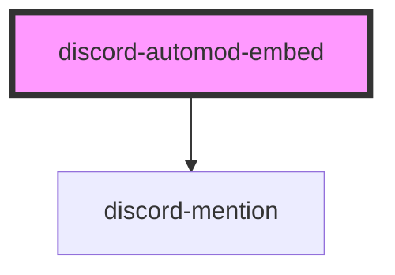

# discord-automod-embed

<!-- Auto Generated Below -->

## Properties

| Property    | Attribute    | Description                                                                                                                        | Type      | Default     |
| ----------- | ------------ | ---------------------------------------------------------------------------------------------------------------------------------- | --------- | ----------- |
| `active`    | `active`     | Whether the embed is active.                                                                                                       | `boolean` | `false`     |
| `color`     | `color`      | The color to use for the embed's left border. Can be any [CSS color value](https://www.w3schools.com/cssref/css_colors_legal.asp). | `string`  | `undefined` |
| `userColor` | `user-color` | The user's color.                                                                                                                  | `string`  | `undefined` |
| `userImage` | `user-image` | The user's avatar URL.                                                                                                             | `string`  | `undefined` |
| `userName`  | `user-name`  | The user's name.                                                                                                                   | `string`  | `undefined` |

## Dependencies

### Depends on

-   [discord-mention](../discord-mention)

### Graph

---

_Built with [StencilJS](https://stenciljs.com/)_
