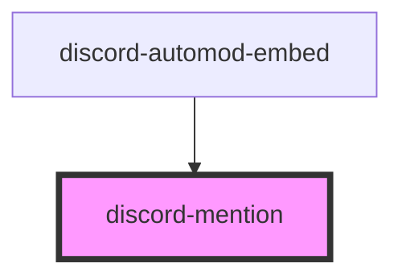

# discord-mention

<!-- Auto Generated Below -->

## Properties

| Property    | Attribute   | Description                                                                                                                                                                    | Type                                                                                                                                                     | Default     |
| ----------- | ----------- | ------------------------------------------------------------------------------------------------------------------------------------------------------------------------------ | -------------------------------------------------------------------------------------------------------------------------------------------------------- | ----------- |
| `color`     | `color`     | The color to use for this mention. Only works for role mentions and must be in hex format.                                                                                     | `string`                                                                                                                                                 | `undefined` |
| `highlight` | `highlight` | Whether this entire message block should be highlighted (to emulate the "logged in user" being pinged).                                                                        | `boolean`                                                                                                                                                | `false`     |
| `type`      | `type`      | The type of mention this should be. This will prepend the proper prefix character. Valid values: `user`, `channel`, `role`, `voice`, `locked`, `thread`, `forum`, and `slash`. | `"automod" \| "browse" \| "channel" \| "customize" \| "forum" \| "guide" \| "locked" \| "members" \| "role" \| "slash" \| "thread" \| "user" \| "voice"` | `'user'`    |

## Dependencies

### Used by

 - [discord-automod-embed](../discord-automod-embed)

### Graph

----------------------------------------------

*Built with [StencilJS](https://stenciljs.com/)*
